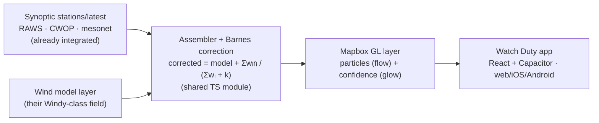

# Technical Brief — Vane-Corrected Wind for Watch Duty

**One line:** A drop-in TypeScript module + one Mapbox GL layer that reconciles Watch Duty's
animated wind model with its own Synoptic weather vanes — and flags, live, where the two
disagree — using data and tooling Watch Duty already has.

**See it running:**
- Live demo → `https://finn-watchduty.vercel.app`
- Concept / problem / solution explainer → `https://finn-watchduty.vercel.app/explainer.html`
- Source (this repo) → Next.js + MapLibre GL + a hand-rolled canvas particle engine + dependency-free interpolation math.

---

## 1. The problem (in Watch Duty terms)

Watch Duty draws a **smooth global wind model** (a Windy-class layer) over the terrain and plots
**real weather-station vanes** (Synoptic: RAWS, CWOP/personal, mesonet) on top. In complex terrain
the two frequently disagree — the model can't resolve ridge-channeled flow — yet the animated layer
is presented as if it were ground truth. During a fire, that gap is a safety issue.

This POC reconstructs a wind field **pinned to the real vanes** and renders an honest **disagreement
view** that glows where the model is wrong, instead of implying flow no nearby vane supports.

---

## 2. How it maps to the Watch Duty stack

Watch Duty is **React + Capacitor** (one web codebase across web/iOS/Android), **Mapbox GL JS** for
maps, a **Python** backend on **AWS/Heroku**, with weather stations from **Synoptic**. The POC was
built to port into exactly that with no new language, renderer, or vendor.

| POC component (this repo) | Watch Duty equivalent | Integration effort |
| --- | --- | --- |
| `app/components/WindMap.tsx` — MapLibre GL map + style | Mapbox GL JS map (already in app) | Rename import; MapLibre is an API-compatible fork |
| `app/components/particles.ts` — canvas `ParticleField` overlay | Mapbox **custom layer** / canvas overlay in the Capacitor webview | Drops in; runs identically on web · iOS · Android |
| `app/lib/interpolate.ts` — Barnes correction, samplers (pure TS, no deps) | Shared module in their React/TS app | Copy in as-is |
| `app/api/wind/route.ts` — assembles vanes + model | Thin **Python** endpoint, *or* client-side (they already fetch both) | Reuse existing Synoptic + model data |
| Synoptic `stations/latest` (`scripts/check-synoptic.mjs`) | **Data they already pay for** | No new vendor / infra |
| `app/lib/colormap.ts`, `Legend`, `Panel` | Existing UI components | Restyle to their design system |

**Net new surface area:** one TypeScript math module + one Mapbox layer + one data assembler.
No native code. No new services. No C++/GPU shaders required (a GPU path is available later).

---

## 3. Architecture / data flow

The math is **single-pass Barnes objective analysis**: interpolate each vane's residual
(observation − model) with a distance-weighted Gaussian and add it back. `+ k` makes the field
honour the vanes where coverage is dense and relax to the model where it's sparse. The
**disagreement** layer advects particles through the *real* (corrected) wind so direction stays
meaningful, and colours them by `|corrected − model|` so the map glows where they diverge.

---

## 4. Phased rollout (low-risk first)

**Phase 0 — Spike (≈1–2 days).** Port `interpolate.ts` + the canvas overlay into a branch of the
app, fed by their Synoptic data and model field, behind a feature flag. Validate on one fire/region.

**Phase 1 — Disagreement / "wind confidence" overlay (the wedge, ≈1 week).** Ship *only* the
glow-where-it-disagrees layer as an optional toggle. It does **not** touch the existing model layer
and never claims a derived field is truth — it just flags uncertainty against their own vanes.
Lowest risk, highest trust, immediately useful.

**Phase 2 — Vane-corrected field (≈1–2 weeks).** Add the corrected flow as a second optional layer,
with the radius-of-influence control and the per-station model↔vane comparison readout.

**Phase 3 — Terrain + alerting (backlog).** Elevation-aware weighting (RAWS elevation is in
Synoptic) so ridge wind doesn't bleed into canyons; a GPU/Mapbox-custom-layer particle path for
density; and "alert me when the model and ridge vanes diverge by > X" tied to their existing alert
system.

---

## 5. Why it fits the "keep it simple" ethos

- **Reuses what exists:** Synoptic (their vanes), Mapbox GL JS (their map), Python (their backend).
- **No new infrastructure or vendor**; degrades gracefully to a bundled snapshot if upstreams fail.
- **Additive and reversible:** every piece is an optional, feature-flagged layer — not a rewrite.
- **Volunteer-friendly:** pure TypeScript + Python, the same languages they chose for onboarding.

---

## 6. Risks & mitigations

| Risk | Mitigation (already in the POC) |
| --- | --- |
| "Can't present a derived field as fact" | Phase 1 ships only the *disagreement* overlay — honest by construction |
| Noisy CWOP/personal stations | Robust **median** gap headline; keep-calm + drop-stale handling; spatial thinning |
| Mobile performance | 2-D canvas at ~60 vanes is cheap in the webview; GPU path available in Phase 3 |
| Maintenance burden | One TS module + existing data + existing Mapbox; ~no new ops |
| Model field access | POC uses Open-Meteo as a stand-in; with their real wind field the result is strictly better |

---

## 7. To confirm with the Watch Duty team

- Backend framework specifics (it's Python — Django/DRF not public).
- The exact wind-layer provider/model (Windy vs. another GFS/HRRR animation) and whether the raw
  grid is available client-side for the correction.
- Preferred integration point: client-side in the app vs. a Python endpoint.

---

## 8. The ask

A 20-minute demo with whoever owns the map, a technical chat with an engineer, and the green light to
open a **feature-flagged PR** (Phase 0/1) against the app. We'll bring this brief, the live demo, and
the explainer.
